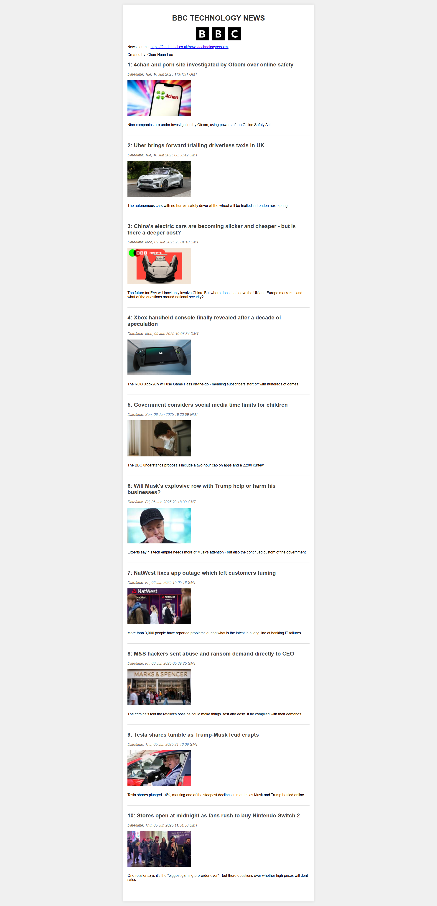

# 📰 News Aggregator - Here and There

> A comprehensive Python GUI application for aggregating and displaying technology news from multiple sources

[](https://python.org)
[](https://docs.python.org/3/library/tkinter.html)
[](./LICENSE)

## 📋 Table of Contents

- [Overview](#-overview)
- [Features](#-features)
- [Screenshots](#-screenshots)
- [Installation](#-installation)
- [Usage](#-usage)
- [Technical Architecture](#%EF%B8%8F-technical-architecture)
- [Project Structure](#-project-structure)
- [Dependencies](#-dependencies)
- [Development](#%EF%B8%8F-development)
- [Academic Information](#-academic-information)

## 🎯 Overview

**News Aggregator** is a desktop application built for QUT's ITD104 "Building IT Systems" course that combines HTML/CSS markup languages with Python scripting, pattern matching, and GUI design. The application allows users to compare and view technology news stories from multiple reputable sources including BBC and ABC News.

The application fetches live RSS feeds, parses XML content, and presents news in an intuitive graphical interface with options to export summaries as HTML documents or view original sources directly.

## ✨ Features

### 🔄 **Live News Aggregation**
- Real-time fetching from BBC and ABC technology RSS feeds
- Automatic XML parsing and content extraction
- Clean, formatted news presentation

### 🖥️ **Intuitive GUI Interface**
- Modern Tkinter-based graphical user interface
- Feed selection with radio buttons
- Scrollable news summaries
- Responsive design with custom styling

### 📊 **Quick Summaries**
- Side-by-side comparison of news feeds
- Instant summary generation
- Real-time feed updates

### 📤 **Export Capabilities**
- HTML export with professional styling
- Embedded logos and branding
- Mobile-responsive output format
- Direct integration of news images

### 🌐 **Web Integration**
- Direct access to original news sources
- Built-in web browser integration
- Live website viewing

### 🎨 **Visual Enhancements**
- Custom background imagery
- Source-specific logos (BBC, ABC)
- Professional color schemes
- Loading progress indicators

## 📸 Screenshots

<details>
<summary><strong>GUI View</strong></summary>


</details>

<details>
<summary><strong>Export to HTML View</strong></summary>


</details>

## 🚀 Installation

### Prerequisites

- Python 3.x (3.6 or higher recommended)
- Standard Python libraries (included with Python installation)

### Quick Start

1. **Clone or Download** the project files to your local machine

2. **Verify Required Files** are present:
   ```
   News_Aggregator.py   # Main application file
   BBC_Logo.png         # BBC logo image
   ABC_Logo.png         # ABC logo image  
   Background.png       # Application background
   ```

3. **Run the Application**:
   ```bash
   python News_Aggregator.py.py
   ```

## 📖 Usage

### Starting the Application

```bash
python News_Aggregator.py
```

### Basic Workflow

1. **Launch Application** - The GUI will open with the main interface
2. **Select News Source** - Choose between BBC or ABC using radio buttons
3. **View Quick Summary** - Click "Display Quick Summary" to see recent headlines
4. **Export to HTML** - Generate a formatted HTML document of the news
5. **Open Live Website** - Access the original news source directly

### Interface Sections

#### 📡 **Feeds Section**
- Radio button selection for news sources
- Currently supports BBC Technology and ABC Technology feeds

#### 📋 **Quick Summaries Section**  
- Side-by-side display of news from both sources
- Scrollable text areas for easy reading
- Automatic content formatting

#### ⚙️ **Display Options Section**
- "Display Quick Summary" - Shows headlines and snippets
- "Export to HTML" - Creates formatted HTML document
- "Open Live Website" - Opens source website in browser

## 🏗️ Technical Architecture

### Core Components

#### `NewsAggregator` Class
The main application class that handles:
- GUI initialization and layout management
- RSS feed fetching and parsing
- HTML generation and export
- User interaction management

#### Key Methods

- **`fetch_rss_content(url)`** - Downloads RSS XML content
- **`parse_rss_content(content)`** - Extracts news items from XML
- **`clean_html(text)`** - Sanitizes HTML entities in text
- **`generate_html_content()`** - Creates formatted HTML export
- **`setup_gui()`** - Initializes the Tkinter interface

### Data Flow

```
RSS Feed → XML Parser → Data Extraction → GUI Display
     ↓
HTML Export ← Content Formatting ← Clean Text Processing
```

### RSS Sources

- **BBC Technology**: `https://feeds.bbci.co.uk/news/technology/rss.xml`
- **ABC Technology**: `https://www.abc.net.au/news/feed/1534/rss.xml`

## 📁 Project Structure

```
News-Aggregator/
├── News_Aggregator.py   # Main application file (632 lines)
├── BBC_Logo.png         # BBC branding image (3.1KB)
├── ABC_Logo.png         # ABC branding image (28KB)
├── Background.png       # Application background (5.4MB)
├── bbc_news.html        # Sample HTML export (7.1KB)
└── README.md            # This documentation file
```

## 📦 Dependencies

### Standard Python Libraries
- `tkinter` - GUI framework
- `tkinter.scrolledtext` - Scrollable text widgets  
- `tkinter.ttk` - Enhanced UI components
- `urllib.request` - Web content fetching
- `re` - Regular expression processing
- `webbrowser` - Browser integration
- `datetime` - Date/time handling
- `sys` - System operations

### External Requirements
- **Internet Connection** - Required for RSS feed fetching
- **Web Browser** - For live website viewing
- **Image Files** - Logo and background assets must be present

## 🛠️ Development

### Code Organization

The application follows object-oriented design principles:

- **Single Responsibility** - Each method handles a specific function
- **Modular Design** - Clear separation between GUI, data processing, and export
- **Error Handling** - Robust exception management for network operations
- **Clean Code** - Comprehensive documentation and readable structure

### Extending the Application

To add new news sources:

1. Add new feed URL to the class attributes
2. Create corresponding logo image file
3. Update the GUI radio button section
4. Add feed option to the selection logic

### Testing

The application includes built-in error handling for:
- Network connectivity issues
- Invalid RSS feed content  
- File I/O operations
- GUI component failures

## 🎓 Academic Information

### Course Details
- **Unit**: Building IT Systems
- **Institution**: Queensland University of Technology (QUT)
- **Assessment**: Individual Project

### Learning Objectives Demonstrated
- HTML/CSS markup languages
- Python scripting and GUI development
- Regular expression pattern matching
- Web content fetching and parsing
- Object-oriented programming principles
- User interface design

### Academic Integrity
This project represents original individual work completed in accordance with QUT's Academic Integrity policies (Manual of Policies and Procedures, Section C/5.3).

---

## 📄 License

This project is developed for educational purposes as part of QUT's coursework. All code is subject to academic integrity policies and is not intended for commercial use.

---

*Author: *[Chun-Huan Lee](https://github.com/Chun-Huan-Lee)*
